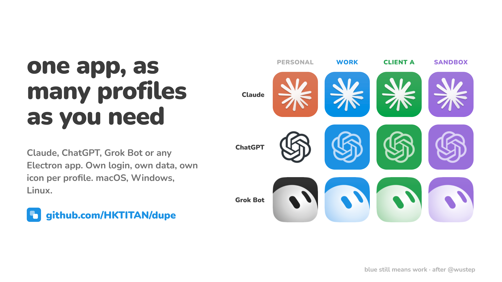

# dupe



Run any desktop app as several isolated, colour-coded profiles. One install of Claude, ChatGPT, Grok Bot, Slack, VS Code or Chrome becomes "Claude Work", "Claude Client A", "Claude Personal": each with its own login, its own data, its own Dock/taskbar entry and a recoloured icon so you can tell them apart at a glance.

**Where it comes from.** Stephen Wu ([@wustep](https://x.com/wustep)) posted his Dock with two icons for every AI app, one stock and one blue, and shared the script behind it: [`Rebuild-Work-Apps.command`](https://gist.github.com/wustep/691823b666bd9c3c340c516279526a17), which APFS-clones the macOS apps, recolours their icons and pins each clone to its own profile. This project is that gist generalised: any number of profiles instead of two, any app that honours Chromium's `--user-data-dir`, on macOS, Windows and Linux, with a browser interface and an agent plugin on top. His two icon treatments (hue rotation for coloured icons, a lightness ramp for grayscale ones) are kept, re-done in OKLCH. Blue still means work.

Three ways in:

- **Command line**: `npm install -g dupe`, then `dupe add claude work`.
- **Interface**: `dupe ui` opens a page connected to your computer; the same page at [hktitan.github.io/dupe](https://hktitan.github.io/dupe/) recolours icons on any device, phones included.
- **Your agent**: the repo is an [Agent Plugin](https://agent-plugins.org/) and a Claude Code plugin, with skills and an MCP server, so an agent can build profiles without you installing anything else. See [Use it from your agent](#use-it-from-your-agent).

```
$ dupe add claude work
Claude · work  "Claude Work"  #1b91e3
  icon        Claude.exe 256px → #1b91e3 (hue)
  launcher    C:\Users\you\.dupe\launchers\claude\work\Claude Work.exe
  start menu  C:\Users\you\AppData\Roaming\Microsoft\Windows\Start Menu\Programs\Claude Work.lnk

Built "Claude Work". It's in the Start Menu; pin it to the taskbar from there.
```

## Install

```bash
npm install -g dupe        # or: npx dupe …
```

Node 20 or newer. Nothing else: the image work (PNG, ICO, ICNS, PE resource extraction, OKLCH recolouring) is pure JavaScript, and each platform backend uses only tools the OS already ships.

## Use

```
dupe list                      Apps found on this machine and profiles built so far
dupe add <app> <profile>       Build a profile            dupe add chatgpt work
dupe add <app> <profile> --color green --label "Claude · Acme"
dupe remove <app> <profile>    Remove the launcher (add --purge to delete its data too)
dupe rebuild [app]             Rebuild after the stock app updated (macOS needs this)
dupe open <app> <profile>      Launch a profile
dupe icon <in> <out> --color … Recolour an icon file on its own (.exe .ico .icns .png)
dupe colors                    The palette
```

`<app>` is a preset id or a path to the app itself (`/Applications/Foo.app`, `C:\…\Foo.exe`, `foo.desktop`, `Foo.AppImage`). Presets know where each app installs and what extra state has to be pinned:

| Preset | Extra isolation | Verified |
| --- | --- | --- |
| `claude` | – | macOS, Windows (Store package) |
| `chatgpt` | `CODEX_HOME` for the Codex agent | macOS, Windows (Store package) |
| `grok-bot` | `SAND_DATA_ROOT` for the local-exec daemon | macOS, Windows |
| `slack` `discord` `notion` `obsidian` | – | Electron flag, not individually tested |
| `vscode` `cursor` | `--extensions-dir` | Electron flag, not individually tested |
| `chrome` `edge` `brave` | – | Chromium flag |

Profiles are independent of each other and of the stock app. The first profile of an app is blue; each further one takes the next palette colour (green, purple, amber, red, teal, pink, gray) unless you pass `--color`. All eight sit at the same OKLCH lightness and chroma, so a Dock full of dupes reads as one family that differs only by hue.

## How the icon is recoloured

The app's own icon is pulled from the binary (`.icns`, PE resources, `.ico` or the AppKit-rendered icon) and recoloured toward the target with one of two treatments, chosen from the icon itself:

- **Hue rotation** for colourful icons (Claude's orange tile). Every pixel keeps its lightness and relative chroma and has its hue rotated so the dominant colour lands on the target hue. Done in OKLCH, so the drop shadow, the texture and the near-white starburst survive.
- **Lightness ramp** for grayscale icons (ChatGPT's knot, Grok Bot's ghost), where a hue rotation would do nothing. The icon's field is detected from its outer edge and mapped exactly to the target colour, the mark goes to white, and a dark field gets a third stop below it so outlines darker than the field stay darker instead of collapsing into it. Ramps interpolate in OKLab so the midpoints don't go muddy.

`--treatment hue|ramp-light|ramp-dark` overrides the choice.

## What each platform does

### macOS

A port of the original script. The stock bundle is APFS-cloned (copy-on-write, so it's nearly free) to `/Applications/<Label>.app`; the real binary is renamed and replaced by a launcher that `exec`s it with `--user-data-dir` and the preset's environment; the `.icns` is replaced; `Info.plist` gets the new display name and a `.<profile>` suffix on the bundle id so macOS treats it as a distinct app; Sparkle/electron-updater are disabled; the bundle is ad-hoc re-signed and its quarantine flag dropped.

Clones are frozen snapshots. After the stock app updates itself, run `dupe rebuild`. Profile data lives in `~/Library/Application Support/dupe/<app>/<profile>`, so rebuilding never touches logins.

### Windows

Nothing is cloned. Each profile gets a tiny launcher `.exe` under `~/.dupe/launchers`, compiled on the spot with the `csc.exe` that every Windows 10/11 ships in the .NET Framework folder, plus a Start Menu shortcut. The launcher:

1. resolves the stock executable at launch time (Store packages move to a new versioned folder on every update, so the package family is looked up in the per-user AppModel registry key rather than trusting a path),
2. starts it with `--user-data-dir` and the preset's environment,
3. stays alive beside the app and stamps each of its top-level windows with the profile's own AppUserModelID, relaunch name and icon, and sets the window icon.

That last step is what gives the profile its own taskbar group, icon and pin even though the process, the binary and the AppUserModelID the app sets on itself are all shared with the stock install. Works for classic installs (Squirrel, NSIS) and for Store/MSIX packages, without touching the package.

The launcher process (a few MB) lives as long as the app does. Rebuilding is only needed if you change the label or colour; app updates are picked up automatically.

### Linux

Nothing is cloned. A `.desktop` entry in `~/.local/share/applications` runs the stock binary with `--user-data-dir` and `--class=<WMClass>`, declares the same `StartupWMClass`, and points at the recoloured icon installed into the hicolor theme. GNOME and KDE match the windows to the launcher by class, so the profile gets its own dock entry and icon. Native installs, AppImages and Flatpaks (`flatpak run --env=…`) are handled. If the app's icon is only shipped as SVG, `rsvg-convert`, `inkscape` or ImageMagick is used to rasterise it, or pass `--icon some.png`.

### Android and iOS

Neither lets one app clone another, so the answers are configuration rather than code. They're written up honestly in [docs/android.md](docs/android.md) (work profile via Shelter, OEM app cloning, custom launcher icons) and [docs/ios.md](docs/ios.md) (isolated Home Screen web apps per account, Shortcut-wrapped icons, and why you can't have both at once).

## Limitations worth knowing

- Isolation is `--user-data-dir` plus whatever the preset pins. If an app keeps state somewhere else (a keychain entry, a global daemon), that part is shared. Grok Bot and ChatGPT are the two known cases and are handled; report others.
- macOS clones don't auto-update. Windows and Linux profiles do, because they run the stock binary in place.
- On Windows, if you run `dupe` from a terminal that itself runs inside a Store-packaged app (Claude Desktop's terminal, say), AppData writes are virtualised into that package's cache and the shell can't see them. `dupe` keeps everything under `~/.dupe` to stay clear of that, and the Start Menu shortcut is written by the launcher so it lands in the real folder.
- The Windows launcher compiles with the .NET Framework C# compiler. If an enterprise image has removed it, the build fails with a clear message.

## The interface

```bash
dupe ui
```

opens `http://127.0.0.1:<port>/` in your browser. The flow is: pick an app (every installed preset, each shown with its original icon and the dupes it already has, plus "Another app" for any path), name the profile, and pick a colour from a strip of the app's own icon rendered in every palette colour, so you see the result before you build. Existing profiles can be opened, customised (new label or colour, rebuilt in place) or removed. An icon studio for arbitrary icon files sits below, collapsed. The page is the same file that is hosted at [hktitan.github.io/dupe](https://hktitan.github.io/dupe/); there, without a local server, it runs the icon pipeline in the browser (drop a PNG, SVG, ICO or ICNS, download a PNG, ICO or ICNS) and shows the commands for everything else. The API is bound to 127.0.0.1 and rejects cross-origin requests.

## Use it from your agent

The repository is a plugin in two formats that share the same files:

- **[Agent Plugins](https://agent-plugins.org/) 1.1.0**: `plugin.json`, `mcp.json`, `skills/`.
- **Claude Code**: `.claude-plugin/plugin.json`, `.mcp.json`, `skills/`, plus a `marketplace.json` so it can be added as a marketplace.

```
/plugin marketplace add HKTITAN/dupe
/plugin install dupe@dupe
```

Two skills teach the agent when and how to build profiles (`dupe-profiles`) and recolour icons (`recolor-icon`). The MCP server (`src/mcp.js`, stdio, no dependencies) exposes `list_apps`, `add_profile`, `remove_profile`, `rebuild_profiles`, `open_profile`, `recolor_icon` and `palette`. Nothing is uploaded; every tool runs on the machine the agent runs on. To wire the server into any other MCP client by hand:

```json
{ "mcpServers": { "dupe": { "command": "node", "args": ["/path/to/dupe/src/mcp.js"] } } }
```

## Development

```bash
npm test                       # node:test, pure-JS image pipeline and treatment selection
node scripts/build-web.js      # regenerate docs/dupe-image.js (the browser build of src/image)
```

`src/image/` is standalone and dependency-free: PNG codec, ICO and ICNS read/write, PE icon extraction, area-averaging resize, OKLab/OKLCH conversion and gamut clamping, and the two recolour treatments.

## Credits

Stephen Wu ([@wustep](https://x.com/wustep)) for the original script, the two-treatment insight and the "blue means work" convention. The Windows and Linux backends and the OKLCH pipeline are new.

MIT.
